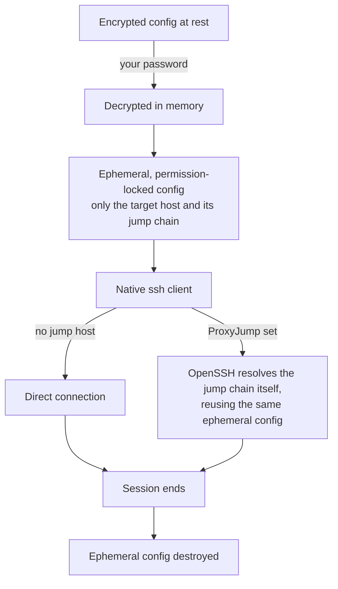

# 🔐 MSSH (Manager/Masked SSH)

**MSSH** is an encrypted SSH config wrapper. It stores your SSH config as ciphertext at rest, decrypts it on demand, and hands the result to the native `ssh` binary. It's a **drop-in replacement**: almost any flag you pass is forwarded to `ssh` untouched, except `-F` and any `-o` option that makes ssh execute a program (`ProxyCommand`, `LocalCommand`, etc.), which are rejected — both would silently override or redirect the connection mssh just decrypted for you.

---

## ✨ Why MSSH?

*   **🔒 Encrypted at Rest:** AES-256-GCM with a fresh salt and IV per save, keyed through a deliberately slow, memory-hard KDF at OWASP's minimum recommended cost. Your SSH config is never plaintext on disk.
*   **🎭 Drop-in Passthrough:** `mssh myserver -L 8080:localhost:80` forwards flags straight to `ssh` — no wrapper-specific syntax to learn. `-F` and any `-o` option that makes ssh execute a program are rejected since they'd bypass the managed config.
*   **🔑 Always-Prompt Listing:** `mssh` and `mssh config list` always ask for the password, even if `MSSH_PASSWORD` is stored in `config.yaml`/`.env`, so a stray setting can't silently dump your host inventory.
*   **🦘 ProxyJump-Aware:** Jump hosts resolve correctly even though OpenSSH re-executes itself as a child process to handle them.
*   **📥 Remote Key Extraction:** `mssh config add` can reach a new host directly and pull a private key from its `~/.ssh` into your local key store.
*   **🧹 Zero-Trace Sessions:** Decrypted data lives only for the life of the connection, locked to your user account, and is destroyed when the session ends.
*   **🪟 Windows ACL Enforcement:** POSIX file modes are silently ignored on Windows, so mssh applies an equivalent ACL restriction instead — and aborts rather than leaving anything exposed.
*   **📦 Single Compiled Binary:** No runtime to install. `bun build --compile` ships one executable per platform.

---

## 🏗️ Architecture at a Glance



The ephemeral config has to outlive the initial handoff to `ssh`: OpenSSH resolves a jump-host chain by re-invoking itself, and that second invocation reads the same file well after the first one returns. Destruction is therefore tied to the session actually ending, not to the handoff — and it is armed before the file is ever created, so an interrupted start leaves nothing behind.

---

## 🚀 Getting Started

### 📋 Prerequisites

mssh wraps the system's OpenSSH client. It does **not** bundle or ship its own SSH implementation — you must have `ssh` installed and on your `PATH`.

**Minimum version: OpenSSH 8.7.** mssh quotes and backslash-escapes any field value containing a space, `#`, quote, or backslash (e.g. a Windows path or a path with spaces) when saving. OpenSSH's `ssh_config` parser only understands that escape syntax as of 8.7 (released August 2021) — an older client fails to parse such a value correctly.

*   **Windows:** run as Administrator:
    ```powershell
    Add-WindowsCapability -Online -Name OpenSSH.Client~~~~0.0.1.0
    ```
    Alternatively, install [Git for Windows](https://gitforwindows.org/), which bundles an `ssh` client.
*   **macOS:** ships with OpenSSH by default. If missing:
    ```sh
    brew install openssh
    ```
*   **Linux:**
    ```sh
    # Debian/Ubuntu
    apt install openssh-client

    # Fedora/RHEL
    dnf install openssh-clients

    # Arch
    pacman -S openssh
    ```

Building from source additionally requires **[Bun](https://bun.sh/)** 1.4+.

---

## 🛠️ Installation

### 📦 Using Pre-Built Binaries

1.  Download the latest release for your platform from the [Releases Page](https://github.com/dimaskiddo/mssh/releases).
2.  Make it executable and put it on your `PATH`:
    ```sh
    chmod +x mssh
    sudo mv mssh /usr/local/bin/mssh
    ```
    On Windows, place `mssh.exe` somewhere on your `PATH`.

### 🔐 Verifying Releases

Release archives are published alongside a `checksum.txt`. To verify a downloaded archive:

```sh
sha256sum -c checksum.txt --ignore-missing
```

### 🏗️ Build From Source

```sh
git clone https://github.com/dimaskiddo/mssh.git
cd mssh
bun install
bun run build
# Binary is located at dist/mssh
```

To build all six platform targets: `bun run build:all`.

---

## 🕹️ Usage & Commands

### 🔧 Setup
*   **`mssh setup`**: Creates the initial empty encrypted config. Refuses to overwrite an existing one, and confirms the password twice since a typo would make the config permanently unopenable.

### 📋 Listing
*   **`mssh`** / **`mssh config list`**: Lists configured hosts. Always prompts for the password, ignoring `MSSH_PASSWORD`, so a stray env var can't silently expose your host list.
*   **`--sort=asc|dsc|cfg`**: Controls the listing order for both forms above. `asc` (default) sorts ascending, `dsc` sorts descending, `cfg` prints hosts in config-file order (no sorting). Sorting is case-sensitive ASCII order. An unrecognized value warns and falls back to `asc`.
    ```sh
    mssh config list --sort=dsc   # descending
    mssh --sort=cfg               # picker in config-file order
    ```

### ✏️ Host Management
*   **`mssh config add`**: Prompts for hostname/port/user/identity file, optionally sets `ProxyJump` to an existing jump-eligible host, and optionally reaches the new host directly to fetch a private key from its `~/.ssh`. If a key was already pulled from that jump host, it's offered for reuse first — no second connection needed.
*   **`mssh config edit [name]`**: Edits one modeled field on a host (`HostName`, `Port`, `User`, `IdentityFile`, `ProxyJump`). Loads, mutates in memory, and re-encrypts — no plaintext ever hits disk.
*   **`mssh config delete [name]`**: Deletes a host. Warns if other hosts `ProxyJump` through it before asking for confirmation.

### 🔌 Connecting
*   **`mssh <host> [ssh flags...]`**: Connects to a configured host. Flags you pass are forwarded to `ssh` untouched, **except** `-F <path>` and any `-o` option that makes ssh execute a program (`ProxyCommand`, `LocalCommand`, `KnownHostsCommand`, etc.), which are rejected before ssh ever runs — both would silently override or redirect the connection away from the config mssh just decrypted:
    ```sh
    mssh myserver
    mssh myserver -L 8080:localhost:80
    mssh -G myserver          # inspect ssh's resolved config for a host
    mssh myserver -F other    # rejected: would replace the decrypted temp config
    ```
    Every saved host carries `ServerAliveInterval 60` to keep idle connections from being dropped by a NAT or firewall timeout; a value you set yourself on a host is left as-is.

### 🔑 Password
*   **`mssh change-password`**: Re-encrypts the existing config under a new password. Always prompts for the current password (ignoring `MSSH_PASSWORD`), then the new one twice. Refuses to write if the new password matches the current one. Warns if a stored `MSSH_PASSWORD` is now stale — mssh does not rewrite that file for you.

### ℹ️ Help & Version
*   **`mssh version`** / **`mssh --version`**: Prints the product name, version, and author.
*   **`mssh --help`** / **`-h`**: Prints usage.

---

## ⚙️ Configuration

mssh keeps everything under `~/.mssh/`. `~` requires an absolute `HOME` (`USERPROFILE` on Windows) — mssh fails with a clear error rather than writing `~/.mssh` relative to whatever directory it was run from.

| Path | Purpose |
|---|---|
| `config` | The encrypted SSH config (default location; override with `MSSH_CONFIG_PATH`). A config left at the old `ssh_config.enc` name is moved here automatically on first run. |
| `config.yaml` | Optional settings file (YAML) — takes precedence over `.env` if both exist |
| `.env` | Optional settings file (`KEY=value`) |

Recognized settings (in either `config.yaml` or `.env`):

| Key | Purpose |
|---|---|
| `MSSH_CONFIG_PATH` | Override the encrypted config location |
| `DEFAULT_SSH_KEY_PATH` | Default identity file offered when adding a new host. When unset, `mssh` offers a key found in your `~/.ssh` (preferring `id_rsa`). |
| `MSSH_PASSWORD` | Master password. Used by `setup`/`add`/`edit`/`delete`/connect. **Never** used by `mssh` or `mssh config list` — those always prompt, by design. |

---

## 🔒 Threat Model

### Protects against

- Backup, cloud-sync, or accidental git commit of your SSH config — on disk it is always ciphertext.
- Casual shoulder-surfing of your host inventory — listing hosts (`mssh`, `mssh config list`) always requires the password, even if one is stored in `MSSH_PASSWORD`.
- Other local users reading the decrypted config mid-session — the run directory and the decrypted temp file are both restricted to your user account.
- Offline brute-force of a stolen `config` — key derivation is deliberately slow and memory-hard, making guessing attempts costly.
- A hand-imported or hand-edited config turning `mssh <host>` into a launcher for arbitrary programs — directives that make ssh execute a program (`ProxyCommand`, `LocalCommand`, `Match exec`, `KnownHostsCommand`, etc.) are dropped on load and refused on save. `ssh` itself is always invoked by its resolved absolute path, never a bare `PATH`-searched name, so a shadowing binary earlier on `PATH` can't run in its place.

### Does not protect against

- **Key material is never wiped from memory.** The derived encryption key and the master password both live as long-lived `Buffer`/`string` values for the duration of a command, and the decrypted config is held as a JS string, which is immutable and cannot be zeroed. A process memory dump or swapped page during that window can expose them. This is a limitation of using JS strings for secrets, not something a partial fix would meaningfully close.
- **The encrypted format's version byte is unauthenticated.** The on-disk layout is `version‖salt‖iv‖tag‖ciphertext`, but only the ciphertext is covered by the AEAD tag — the version byte itself is not bound in as associated data. Tampering with it today just changes which error path a corrupted file takes; it becomes a real concern only if a second format version is ever introduced, at which point the version byte must be authenticated (e.g. via `setAAD`) to prevent a downgrade attack.

---

## 🧪 Testing

```sh
bun test
bunx tsc --noEmit
```

---

## ✍️ Authors

*   **Dimas Restu Hidayanto** - *Initial Work & Architecture* - [DimasKiddo](https://github.com/dimaskiddo)

---

## 🏗️ Dependencies

*   **[Bun](https://bun.sh/)** - Runtime, test runner, and single-binary compiler
*   **[@inquirer/prompts](https://github.com/SBoudrias/Inquirer.js)** - Interactive CLI prompts

mssh wraps the system **[OpenSSH](https://www.openssh.com/)** client rather than bundling its own SSH implementation.

---

## ⚠️ Disclaimer

**DO WITH YOUR OWN RISK (DWYOR)**. This software is provided "as is", without warranty of any kind, express or implied. Use of this software may involve risks, including but not limited to system instability or data loss. The authors are not responsible for any damage caused by the use of this application.

---

## ⚖️ License

Distributed under the **MIT License**. See `LICENSE` for more information.

---
**mssh** — *Your SSH config, encrypted at rest, invisible in transit.* 🔐
