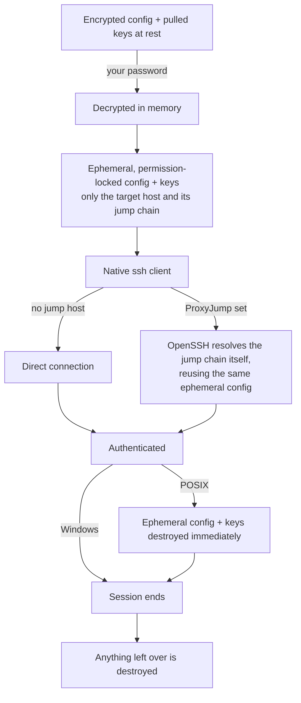

# 🔐 MSSH (Manager/Masked SSH)

**MSSH** is an encrypted SSH config wrapper. It stores your SSH config as ciphertext at rest, decrypts it on demand, and hands the result to the native `ssh` binary. It's a **drop-in replacement**: almost any flag you pass is forwarded to `ssh` untouched, except `-F` and any `-o` option that makes ssh execute a program (`ProxyCommand`, `LocalCommand`, etc.), which are rejected — both would silently override or redirect the connection mssh just decrypted for you.

---

## ✨ Why MSSH?

*   **🔒 Encrypted at Rest:** AES-256-GCM with a fresh salt and IV per save, keyed through a deliberately slow, memory-hard KDF at OWASP's minimum recommended cost. Your SSH config is never plaintext on disk.
*   **🎭 Drop-in Passthrough:** `mssh myserver -L 8080:localhost:80` forwards flags straight to `ssh` — no wrapper-specific syntax to learn. `-F` and any `-o` option that makes ssh execute a program are rejected since they'd bypass the managed config.
*   **🔑 Vault-Mode Password:** every command prompts for the password. The one exception is a direct `mssh <host> [ssh flags...]`, which may take it from the `MSSH_PASSWORD` environment variable — for cron, systemd, and other unattended jobs. It is never read from a settings file; if one is found there, mssh warns and ignores it.
*   **🦘 ProxyJump-Aware:** Jump hosts resolve correctly even though OpenSSH re-executes itself as a child process to handle them.
*   **📥 Remote Key Extraction:** `mssh config add` can reach a new host directly and pull a private key from its `~/.ssh` into your local key store.
*   **🧹 Zero-Trace Sessions:** Decrypted data lives only for the life of the connection, locked to your user account, and is destroyed when the session ends.
*   **🪟 Windows ACL Enforcement:** POSIX file modes are silently ignored on Windows, so mssh applies an equivalent ACL restriction instead — and aborts rather than leaving anything exposed.
*   **📦 Single Compiled Binary:** No runtime to install. `bun build --compile` ships one executable per platform.

---

## 🏗️ Architecture at a Glance


```mermaid
graph TD
    Enc["Encrypted config + pulled keys at rest"] -- "your password" --> Dec["Decrypted in memory"]
    Dec --> Tmp["Ephemeral, permission-locked config + keys<br/>only the target host and its jump chain"]
    Tmp --> Spawn["Native ssh client"]

    Spawn -- "no jump host" --> Direct["Direct connection"]
    Spawn -- "ProxyJump set" --> Jump["OpenSSH resolves the jump chain itself,<br/>reusing the same ephemeral config"]

    Direct --> Auth["Authenticated"]
    Jump --> Auth

    Auth -- "POSIX" --> Purge["Ephemeral config + keys destroyed immediately"]
    Auth -- "Windows" --> Exit["Session ends"]
    Purge --> Exit
    Exit --> Cleanup["Anything left over is destroyed"]
```

The ephemeral config has to outlive the initial handoff to `ssh`: OpenSSH resolves a jump-host chain by re-invoking itself, and that second invocation reads the same file well after the first one returns. On POSIX, mssh detects the moment ssh authenticates — via a `ControlPath` socket that only appears once login succeeds — and destroys the ephemeral config and any decrypted keys right then, rather than waiting for the session to end; Windows' `ssh.exe` has no equivalent signal, so there the plaintext lives for the whole session. Either way, exit-time cleanup is armed before any file is ever created, so an interrupted start, a failed auth, or the session ending all leave nothing behind.

---

## 🚀 Getting Started

### 📋 Prerequisites

mssh wraps the system's OpenSSH client. It does **not** bundle or ship its own SSH implementation — you must have `ssh` installed and on your `PATH`.

**Minimum version: OpenSSH 8.7.** mssh quotes and backslash-escapes any field value containing a space, `#`, quote, or backslash (e.g. a Windows path or a path with spaces) when saving. OpenSSH's `ssh_config` parser only understands that escape syntax as of 8.7 (released August 2021) — an older client fails to parse such a value correctly.

*   **Windows:** run as Administrator:
    ```powershell
    Add-WindowsCapability -Online -Name OpenSSH.Client~~~~0.0.1.0
    ```
    Alternatively, install [Git for Windows](https://gitforwindows.org/), which bundles an `ssh` client.
*   **macOS:** ships with OpenSSH by default. If missing:
    ```sh
    brew install openssh
    ```
*   **Linux:**
    ```sh
    # Debian/Ubuntu
    apt install openssh-client

    # Fedora/RHEL
    dnf install openssh-clients

    # Arch
    pacman -S openssh
    ```

Building from source additionally requires **[Bun](https://bun.sh/)** 1.4+.

---

## 🛠️ Installation

### 📦 Using Pre-Built Binaries

1.  Download the latest release for your platform from the [Releases Page](https://github.com/dimaskiddo/mssh/releases).
2.  Make it executable and put it on your `PATH`:
    ```sh
    chmod +x mssh
    sudo mv mssh /usr/local/bin/mssh
    ```
    On Windows, place `mssh.exe` somewhere on your `PATH`.

    Alternatively, run `mssh setup` (or `./mssh setup`) once — it creates your encrypted config and offers to install itself onto `PATH` for you.
3.  For later upgrades, run `mssh update` instead of repeating these steps by hand.

### 🔐 Verifying Releases

Release archives are published alongside a `checksum.txt`. To verify a downloaded archive:

```sh
sha256sum -c checksum.txt --ignore-missing
```

### 🏗️ Build From Source

```sh
git clone https://github.com/dimaskiddo/mssh.git
cd mssh
bun install
bun run build
# Binary is located at dist/mssh
```

To build all six platform targets: `bun run build:all`.

---

## 🕹️ Usage & Commands

### 🔧 Setup
*   **`mssh setup`**: Creates the initial empty encrypted config. Refuses to overwrite an existing one, and confirms the password twice since a typo would make the config permanently unopenable. When run from a compiled binary, it then offers to install itself to a per-user directory (`~/.local/bin/mssh` on Linux/macOS, `%LOCALAPPDATA%\Programs\mssh\mssh.exe` on Windows) so plain `mssh` works without `sudo` or copying it yourself. If that directory isn't already on your `PATH`, it prints the exact line to add. Running `mssh setup` again against an existing config leaves the config untouched and re-offers the install (or offers to replace an already-installed copy).

### 📋 Listing
*   **`mssh`** / **`mssh config list`**: Lists configured hosts. Always prompts for the password — the `MSSH_PASSWORD` unattended-connect exception (see "Password" below) does not apply here, so a stray env var can't silently expose your host list.
*   **`--sort=asc|dsc|cfg|tags`**: Controls the listing order for both forms above. `asc` (default) sorts ascending, `dsc` sorts descending, `cfg` prints hosts in config-file order (no sorting). Sorting is case-sensitive ASCII order. An unrecognized value warns and falls back to `asc`.
    ```sh
    mssh config list --sort=dsc   # descending
    mssh --sort=cfg               # picker in config-file order
    ```
*   **`--sort=tags`**: Groups the listing under a header per tag instead of a flat list — tag headers A→Z, host names A→Z within each, uppercased for display (`[STAGE]`). A host with several tags appears in every one of its groups. Untagged hosts get a final `[Others]` group (its mixed case keeps it distinct from a tag literally named `others`, which prints as `[OTHERS]`). Combine with `--tags=` to filter first and group only by the given tags — no `[Others]` group appears in that case.
    ```sh
    mssh config list --sort=tags                    # every tag as a group, untagged last
    mssh config list --sort=tags --tags=alibaba      # only the [ALIBABA] group
    ```
*   **`--tags=a,b`**: Filters the listing to hosts carrying **every** given tag (comma-separated, case-insensitive; repeat the flag to combine). If no host matches, prints `No hosts match tag(s): ...` and exits without a picker.
    ```sh
    mssh config list --tags=alibaba       # only hosts tagged "alibaba"
    mssh --tags=alibaba,stage             # only hosts tagged both
    ```

### ✏️ Host Management
*   **`mssh config add`**: Prompts for hostname/port/user/identity file/tags, optionally sets `ProxyJump` to an existing jump-eligible host, and optionally reaches the new host directly to fetch a private key from its `~/.ssh`. The pulled key is sealed under the master password before it ever touches disk. If a key was already pulled from that jump host, it's offered for reuse first — no second connection needed.
*   **`mssh config edit [name]`**: Edits one modeled field on a host (`HostName`, `Port`, `User`, `IdentityFile`, `ProxyJump`) or its `Tags`. Loads, mutates in memory, and re-encrypts — no plaintext ever hits disk.
*   **Tags**: comma-separated labels (letters, digits, `.`, `_`, `-`) for filtering with `--tags=`, stored as an inert `## Tags a,b` comment on the line after `Host` — real `ssh` ignores it, so it's invisible outside mssh. A config saved before this feature simply has no such line, which mssh treats as an untagged host.
*   **`mssh config delete [name]`**: Deletes a host. Warns if other hosts `ProxyJump` through it before asking for confirmation.
*   **`mssh config migrate-keys`**: Encrypts any key under `~/.mssh/keys` still left plaintext by an older mssh version. Every other command does this automatically on its next run; this one exists to run it explicitly and see the result (`Encrypted N pulled key(s)...` or `No plaintext keys found.`).

### 🔌 Connecting
*   **`mssh <host> [ssh flags...]`**: Connects to a configured host. Flags you pass are forwarded to `ssh` untouched, **except** `-F <path>` and any `-o` option that makes ssh execute a program (`ProxyCommand`, `LocalCommand`, `KnownHostsCommand`, etc.), which are rejected before ssh ever runs — both would silently override or redirect the connection away from the config mssh just decrypted:
    ```sh
    mssh myserver
    mssh myserver -L 8080:localhost:80
    mssh -G myserver          # inspect ssh's resolved config for a host
    mssh myserver -F other    # rejected: would replace the decrypted temp config
    ```
    Every saved host carries `ServerAliveInterval 60` to keep idle connections from being dropped by a NAT or firewall timeout; a value you set yourself on a host is left as-is.

    This is the **only** command that honors `MSSH_PASSWORD` — see "Unattended use" below. It is read from the process environment only, never a settings file, and mssh deletes it from its own environment before spawning `ssh` so no child process, and no remote `SendEnv`, ever sees it.

### 🔑 Password
*   **`mssh change-password`**: Re-encrypts the existing config under a new password. Always prompts for the current password, then the new one twice — the `MSSH_PASSWORD` unattended-connect exception never applies here. Refuses to write if the new password matches the current one. Warns if `MSSH_PASSWORD` is set in your environment, since it's now stale for future unattended connects.

### 🤖 Unattended Use
For a cron job or a long-running tunnel, export `MSSH_PASSWORD` for that one job only — never in a shell you also use interactively, and never committed anywhere:

```sh
# cron
MSSH_PASSWORD=hunter2 mssh bastion -N -L 8080:localhost:80

# systemd — EnvironmentFile takes KEY=value, one per line
# /etc/mssh-tunnel.env, chmod 0600, owned by the service's user
EnvironmentFile=/etc/mssh-tunnel.env
ExecStart=/usr/local/bin/mssh bastion -N -L 8080:localhost:80
```

### ⬆️ Updating
*   **`mssh update`**: Downloads the latest release for your OS/architecture, verifies it against the release's `checksum.txt`, and replaces the running binary in place. Never downgrades — if you're already on the latest version (or newer), it says so and does nothing. Running it is the only confirmation asked; there's no extra prompt.
    ```sh
    sudo mssh update   # if mssh is installed somewhere only root can write to
    ```

### ℹ️ Help & Version
*   **`mssh version`** / **`mssh --version`**: Prints the product name, version, and author.
*   **`mssh --help`** / **`-h`**: Prints usage.

---

## ⚙️ Configuration

mssh keeps everything under `~/.mssh/`. `~` requires an absolute `HOME` (`USERPROFILE` on Windows) — mssh fails with a clear error rather than writing `~/.mssh` relative to whatever directory it was run from.

| Path | Purpose |
|---|---|
| `config` | The encrypted SSH config (default location; override with `MSSH_CONFIG_PATH`). A config left at the old `ssh_config.enc` name is moved here automatically on first run. |
| `config.yaml` | Optional settings file (YAML) — takes precedence over `.env` if both exist |
| `.env` | Optional settings file (`KEY=value`) |

Recognized settings (in either `config.yaml` or `.env`):

| Key | Purpose |
|---|---|
| `MSSH_CONFIG_PATH` | Override the encrypted config location |
| `DEFAULT_SSH_KEY_PATH` | Default identity file offered when adding a new host. When unset, `mssh` offers a key found in your `~/.ssh` (preferring `id_rsa`). |

The master password is never a setting — it's always prompted for, except that a direct `mssh <host>` connect may take it from `MSSH_PASSWORD` in the process environment (see "Unattended Use" above). A `MSSH_PASSWORD` found in `config.yaml` or `.env` is ignored, with a warning, since it would mean a plaintext password sitting on disk.

---

## 🧪 Testing

```sh
bun test
bunx tsc --noEmit
```

---

## ✍️ Authors

*   **Dimas Restu Hidayanto** - *Initial Work & Architecture* - [DimasKiddo](https://github.com/dimaskiddo)

---

## 🏗️ Dependencies

*   **[Bun](https://bun.sh/)** - Runtime, test runner, and single-binary compiler
*   **[@inquirer/prompts](https://github.com/SBoudrias/Inquirer.js)** - Interactive CLI prompts

mssh wraps the system **[OpenSSH](https://www.openssh.com/)** client rather than bundling its own SSH implementation.

---

## ⚠️ Disclaimer

**DO WITH YOUR OWN RISK (DWYOR)**. This software is provided "as is", without warranty of any kind, express or implied. Use of this software may involve risks, including but not limited to system instability or data loss. The authors are not responsible for any damage caused by the use of this application.

---

## ⚖️ License

Distributed under the **MIT License**. See `LICENSE` for more information.

---
**mssh** — *Your SSH config, encrypted at rest, invisible in transit.* 🔐
